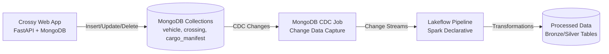

# Crossy - Databricks Lakeflow CDC Demo

This project demonstrates **Databricks Lakeflow** functionality for processing Change Data Capture (CDC) changes from a MongoDB database. The demo simulates vehicle crossings at United States Border Patrol Interior Checkpoints, showcasing how real-time data changes flow from a MongoDB application through CDC capture to Databricks Lakeflow pipelines for processing and transformation.

## Overview

The Crossy project consists of two main components:

1. **Application (`app/`)** - A FastAPI-based web application that manages crossing records (vehicles, cargo information, and people) stored in MongoDB. Users can insert, edit, and delete records through a web interface.

2. **Databricks (`databricks/`)** - Databricks Asset Bundles containing:
   - A MongoDB CDC job that captures change data from MongoDB collections
   - A Spark Declarative pipeline (Lakeflow) that processes the CDC changes

## Architecture

The following diagram illustrates the data flow from the application through CDC capture to Lakeflow processing:



### Component Details

**MongoDB Collections:**
- `vehicle` - Vehicle details (license plate, type, owner, registration, passengers)
- `crossing` - Crossing event data (timestamp, checkpoint, direction, lane, purpose)
- `cargo_manifest` - Cargo information (manifest ID, cargo type, hazardous materials flag, container ID)

**CDC Processing:**
- The MongoDB CDC job monitors collections for insert, update, and delete operations
- Changes are captured and sent to the Lakeflow pipeline for processing

**Lakeflow Pipeline:**
- Processes CDC changes using Spark Declarative pipelines
- Transforms data through bronze and silver layers
- Enables real-time analytics on crossing data

## Project Structure

```
crossy/
├── app/                          # FastAPI web application
│   ├── backend/                  # FastAPI backend code
│   │   ├── main.py              # FastAPI application entry point
│   │   ├── models.py            # Pydantic data models
│   │   ├── database.py          # MongoDB connection logic
│   │   ├── routes.py            # API endpoints
│   │   └── data_generator.py    # Random data generation
│   ├── frontend/                 # HTML/CSS/JavaScript frontend
│   │   ├── index.html           # Main UI
│   │   ├── css/                 # Stylesheets
│   │   └── js/                  # JavaScript modules
│   ├── data/                     # Local filesystem storage
│   ├── instructions/             # Application documentation
│   └── README.md                 # Detailed app documentation
│
├── databricks/                   # Databricks Asset Bundles
│   ├── resources/                # Job and pipeline definitions
│   │   ├── crossy_pipeline.yml  # Lakeflow pipeline configuration
│   │   └── mongodb_cdc_job.yml  # MongoDB CDC job configuration
│   ├── src/                      # Source code and notebooks
│   │   ├── crossy_pipeline/     # Pipeline transformation SQL
│   │   └── mongocdc_job/        # CDC job notebooks
│   ├── databricks.yml           # Asset bundle configuration
│   └── README.md                 # Databricks setup guide
│
└── README.md                     # This file
```

## Quick Start

### Prerequisites

- Python 3.11 or higher
- MongoDB Atlas account and cluster (or local MongoDB instance)
- Databricks workspace with appropriate permissions
- Databricks CLI installed and configured
- `uv` package manager (for Python dependencies)

### Setup Application

1. Navigate to the app directory:
   ```bash
   cd app
   ```

2. Create virtual environment and install dependencies:
   ```bash
   uv venv .venv
   source .venv/bin/activate  # On Windows: .venv\Scripts\activate
   uv pip install -r requirements.txt  # Or install individually
   ```

3. Configure environment variables:
   ```bash
   cp .env.example .env
   # Edit .env with your MongoDB connection string
   ```

4. Start the FastAPI server:
   ```bash
   uv run uvicorn backend.main:app --reload --port 8000
   ```

5. Open the application: http://localhost:8000

For detailed setup instructions, see [app/README.md](app/README.md).

### Setup Databricks

1. Navigate to the databricks directory:
   ```bash
   cd databricks
   ```

2. Authenticate to your Databricks workspace:
   ```bash
   databricks configure
   ```

3. Update `databricks.yml` with your workspace configuration:
   - Set `warehouse_id`, `catalog`, and `schema` variables
   - Configure MongoDB connection parameters in job definitions

4. Deploy the asset bundle:
   ```bash
   databricks bundle deploy --target dev
   ```

5. Run the CDC job:
   ```bash
   databricks bundle run mongodb_cdc
   ```

For detailed Databricks setup, see [databricks/README.md](databricks/README.md).

## Data Flow

### End-to-End Process

1. **Data Creation/Modification**
   - Users interact with the Crossy web application to create, edit, or delete crossing records
   - Changes are persisted to MongoDB collections (`vehicle`, `crossing`, `cargo_manifest`)

2. **CDC Capture**
   - The MongoDB CDC job monitors the collections for changes
   - Insert, update, and delete operations are captured as change events
   - Change events are streamed to the Lakeflow pipeline

3. **Lakeflow Processing**
   - The Spark Declarative pipeline receives CDC changes
   - Data is processed through bronze layer (raw CDC events)
   - Transformations are applied in silver layer (cleaned, validated data)
   - Processed data is available for analytics and reporting

4. **Output**
   - Processed crossing data is available in Databricks tables
   - Analytics can be performed on the transformed data
   - Real-time insights can be generated from the CDC stream

### Example Workflow

1. User creates a new vehicle crossing record in the web app
2. Record is saved to MongoDB `crossing` collection
3. CDC job detects the insert operation
4. Change event is sent to Lakeflow pipeline
5. Pipeline processes the change and updates bronze/silver tables
6. Analytics queries can immediately access the new crossing data

## Additional Resources

- **[app/README.md](app/README.md)** - Detailed documentation for the Crossy web application, including API endpoints, data models, and features
- **[databricks/README.md](databricks/README.md)** - Databricks Asset Bundle setup and deployment guide
- **[app/instructions/crossy.md](app/instructions/crossy.md)** - Application requirements and specifications
- **[app/instructions/implementation_plan.md](app/instructions/implementation_plan.md)** - Implementation details and architecture decisions

## Technology Stack

**Application:**
- Backend: Python, FastAPI, Motor (async MongoDB driver)
- Frontend: HTML5, Vanilla JavaScript, Bootstrap 5
- Database: MongoDB Atlas
- Storage: Local filesystem (JSON files)

**Databricks:**
- Databricks Asset Bundles for deployment
- Databricks Lakeflow for CDC processing
- Spark Declarative Pipelines for transformations
- SQL warehouses for data processing

## License

This is a demonstration project and is not intended for production use.

